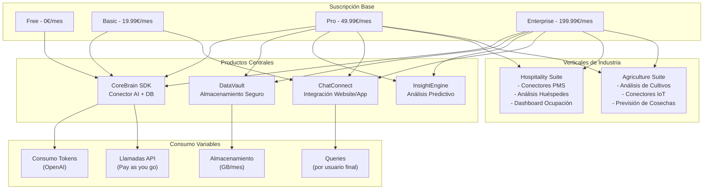
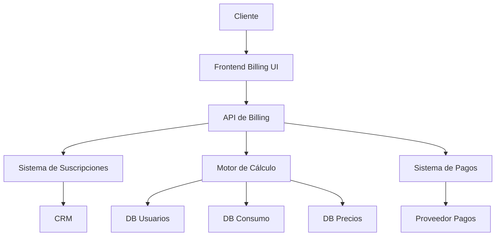

# DataPulse: Sistema de Billing Integral
**Plataforma de Transformación de Datos con IA para Sectores Verticales**

---

## Índice
1. [Resumen Ejecutivo](#1-resumen-ejecutivo)
2. [Fundamentos del Modelo de Negocio](#2-fundamentos-del-modelo-de-negocio)
3. [Estructura de Planes y Precios](#3-estructura-de-planes-y-precios)
4. [Estrategia de Monetización por Sector](#4-estrategia-de-monetización-por-sector)
5. [Análisis de Costes y Márgenes](#5-análisis-de-costes-y-márgenes)
6. [Implementación Técnica](#6-implementación-técnica)
7. [Panel de Control y Herramientas](#7-panel-de-control-y-herramientas)
8. [Plan de Evolución en Fases](#8-plan-de-evolución-en-fases)
9. [Estrategias de Go-to-Market](#9-estrategias-de-go-to-market)
10. [Métricas Clave y KPIs](#10-métricas-clave-y-kpis)
11. [Comparativa Competitiva](#11-comparativa-competitiva)
12. [Conclusiones y Recomendaciones](#12-conclusiones-y-recomendaciones)

---

## 1. Resumen Ejecutivo

DataPulse representa una revolución en la transformación de datos con IA, especialmente diseñada para los sectores de Hospitality y Agricultura. La plataforma se distingue por su capacidad de conectar bases de datos SQL y NoSQL con modelos avanzados de IA como GPT-4, permitiendo análisis profundos, consultas en lenguaje natural y generación de informes automáticos.

El modelo de negocio está estructurado en **cuatro dimensiones clave**:

1. **Suscripciones base**: Desde Free a Enterprise
2. **Productos modulares**: CoreBrain, DataVault, InsightEngine, ChatConnect
3. **Verticales de industria**: Hospitality Suite, Agriculture Suite
4. **Consumo variable**: API calls, tokens, consultas, almacenamiento

Este enfoque multi-dimensional permite una monetización eficiente, similar a cómo Snowflake separa almacenamiento y computación o cómo Salesforce construye "nubes" específicas por industria, pero optimizado para el contexto de IA generativa.

Con márgenes que oscilan entre el 40% y el 85% dependiendo del componente, y un potencial de ingresos recurrentes por cliente de 1,200€ a 25,000€ anuales, DataPulse establece un nuevo paradigma en la monetización de plataformas de datos potenciadas por IA.

---

## 2. Fundamentos del Modelo de Negocio

### 2.1 Pilares Estratégicos

1. **Base + Consumo**: Combinación de suscripción fija y facturación por uso
2. **Especialización vertical**: Soluciones específicas por sector con alto valor añadido
3. **Escalabilidad tecnológica**: Arquitectura modular que permite crecimiento orgánico
4. **Enfoque data-centric**: El valor está en la conexión con datos propios, no solo en la IA

### 2.2 Propuesta de Valor Diferencial

- **Para Hospitality**: "Transforme sus datos operacionales en insights predictivos que optimicen ocupación y satisfacción"
- **Para Agricultura**: "Conecte sensores, análisis de cultivos y previsiones en una única plataforma inteligente"

### 2.3 Estructura Multi-dimensional




---

## 3. Estructura de Planes y Precios

### 3.1 Planes Base

| Plan | Precio | Características Principales | Límites Incluidos | Ideal Para |
|------|--------|----------------------------|-------------------|------------|
| **Free** | 0€/mes | • CoreBrain básico<br>• 1 proyecto<br>• Exportación JSON<br>• Soporte por email | • 100K tokens/mes (GPT-3.5)<br>• 20 API calls/día<br>• 50 consultas/mes<br>• 500MB almacenamiento | Startups y desarrolladores individuales |
| **Basic** | 19.99€/mes | • CoreBrain completo<br>• ChatConnect básico<br>• Hasta 5 proyectos<br>• Exportación múltiple<br>• Soporte por chat | • 500K tokens/mes (GPT-3.5)<br>• 100 API calls/día<br>• 500 consultas/mes<br>• 2GB almacenamiento | Pequeñas empresas y proyectos departamentales |
| **Pro** | 49.99€/mes | • CoreBrain con GPT-4-Turbo<br>• Todos los productos<br>• Verticales básicas<br>• Soporte telefónico | • 1M tokens/mes (GPT-4-Turbo)<br>• 10K API calls/día<br>• 5K consultas/mes<br>• 10GB almacenamiento | Empresas medianas y proyectos críticos |
| **Enterprise** | 199.99€/mes | • CoreBrain con GPT-4<br>• Verticales avanzadas<br>• API dedicada<br>• Onboarding personalizado | • 2M tokens/mes (GPT-4)<br>• 100K API calls/día<br>• 50K consultas/mes<br>• 50GB almacenamiento | Grandes empresas y aplicaciones críticas |

### 3.2 Productos Modulares

| Producto | Descripción | Disponibilidad | Precio Individual |
|----------|-------------|----------------|-------------------|
| **CoreBrain** | Conecta bases de datos con IA para analizar datos y generar insights | Todos los planes con diferentes modelos IA | Incluido en todos los planes |
| **DataVault** | Almacenamiento seguro y estructurado de datos con encriptación | Pro y Enterprise | 19.99€/mes |
| **InsightEngine** | Motor de análisis predictivo e informes avanzados con IA | Pro y Enterprise | 39.99€/mes |
| **ChatConnect** | Integración de chat con IA para websites y aplicaciones | Basic, Pro y Enterprise | 29.99€/mes |

### 3.3 Verticales de Industria

| Vertical | Componentes | Disponibilidad | Precio Individual |
|----------|-------------|----------------|-------------------|
| **Hospitality Suite** | • Conectores PMS<br>• Análisis de satisfacción<br>• Optimización de precios<br>• Dashboard específico | Pro (básico)<br>Enterprise (completo) | 49.99€/mes |
| **Agriculture Suite** | • Análisis de cultivos<br>• Integración sensores<br>• Previsión de cosechas<br>• Trazabilidad | Pro (básico)<br>Enterprise (completo) | 59.99€/mes |

### 3.4 Precios por Consumo (Pay-as-you-go)

| Métrica | Plan Base | Límite Incluido | Precio Adicional |
|---------|-----------|-----------------|------------------|
| **API Calls** | Free<br>Basic<br>Pro<br>Enterprise | 20/día<br>100/día<br>10K/día<br>100K/día | 0.003€/llamada (0-1K)<br>0.0025€/llamada (1K-10K)<br>0.002€/llamada (10K-100K)<br>0.0015€/llamada (>100K) |
| **Tokens** | Free<br>Basic<br>Pro<br>Enterprise | 100K/mes (GPT-3.5)<br>500K/mes (GPT-3.5)<br>1M/mes (GPT-4-T)<br>2M/mes (GPT-4) | Varía según modelo:<br>• GPT-3.5: 0.008€/1K tokens<br>• GPT-4-Turbo: 0.10€/1K tokens<br>• GPT-4: 0.20€/1K tokens<br>• GPT-4-32K: 0.32€/1K tokens |
| **User Queries** | Free<br>Basic<br>Pro<br>Enterprise | 50/mes<br>500/mes<br>5K/mes<br>50K/mes | 0.02€/consulta (0-1K)<br>0.015€/consulta (1K-10K)<br>0.01€/consulta (10K-100K)<br>0.007€/consulta (>100K) |
| **Storage** | Free<br>Basic<br>Pro<br>Enterprise | 500MB<br>2GB<br>10GB<br>50GB | 0.10€/GB (0-10GB)<br>0.08€/GB (11-100GB)<br>0.06€/GB (101-1000GB)<br>0.04€/GB (>1000GB) |

### 3.5 Add-ons y Complementos

| Add-on | Descripción | Disponibilidad | Precio |
|--------|-------------|----------------|--------|
| **Usuarios adicionales** | Acceso para más miembros del equipo | Basic, Pro, Enterprise | 14.99€/usuario/mes (Pro)<br>12.99€/usuario/mes (Enterprise) |
| **Modelos personalizados** | Fine-tuning específico para caso de uso | Pro, Enterprise | 199.99€/mes (Pro)<br>149.99€/mes (Enterprise)<br>+ 999.99€ setup inicial |
| **Acceso GPT-4 Premium** | Acceso a modelos avanzados | Pro, Enterprise | 99.99€/mes (Pro → GPT-4)<br>49.99€/mes (Enterprise → GPT-4-32K) |
| **Infraestructura dedicada** | Servidores exclusivos para rendimiento óptimo | Enterprise | 499.99€/mes + 1999.99€ setup |
| **Soporte 24/7** | Asistencia técnica en cualquier momento | Enterprise | 299.99€/mes |

---

## 4. Estrategia de Monetización por Sector

### 4.1 Sector Hospitality

#### 4.1.1 Casos de Uso Principales
- Análisis de satisfacción de huéspedes basado en reviews
- Optimización dinámica de precios según demanda
- Previsión de ocupación y gestión de recursos
- Asistente virtual para resolución de consultas

#### 4.1.2 Estructura de Precios Específica

| Componente | Descripción | Precio |
|------------|-------------|--------|
| **Hospitality Suite Base** | Funcionalidades core para hoteles | 49.99€/mes |
| **Conectores PMS** | Integración con Property Management Systems | 14.99€/mes por conector |
| **Optimización de precios** | Motor de recomendación de tarifas | 29.99€/mes (incluido en Enterprise) |
| **Análisis de satisfacción avanzado** | Procesamiento de opiniones con IA | Incluido en Pro/Enterprise |

#### 4.1.3 ROI para el Cliente
Un hotel boutique de 50 habitaciones puede incrementar su ingreso medio por habitación en un 12% mediante la optimización de precios y aumentar su índice de satisfacción en 0.8 puntos, lo que representa un ROI de 5.2x sobre la inversión anual en DataPulse.

### 4.2 Sector Agricultura

#### 4.2.1 Casos de Uso Principales
- Monitorización de salud de cultivos con análisis visual
- Integración con sensores IoT para decisiones en tiempo real
- Previsión de cosechas basada en datos históricos y condiciones actuales
- Trazabilidad de productos desde cultivo hasta distribución

#### 4.2.2 Estructura de Precios Específica

| Componente | Descripción | Precio |
|------------|-------------|--------|
| **Agriculture Suite Base** | Funcionalidades core para agricultura | 59.99€/mes |
| **Análisis por tipo de cultivo** | Modelos específicos por cultivo | 9.99€/mes por tipo |
| **Integración sensores** | Conexión con dispositivos IoT | 14.99€/mes por tipo de sensor |
| **Previsión avanzada** | Algoritmos predictivos específicos | 39.99€/mes (incluido en Enterprise) |

#### 4.2.3 ROI para el Cliente
Una explotación agrícola de tamaño medio puede reducir el uso de agua en un 22%, optimizar el uso de fertilizantes en un 18% y aumentar el rendimiento de la cosecha en un 8-15%, representando un ROI de 3.8x sobre la inversión anual en DataPulse.

---

## 5. Análisis de Costes y Márgenes

### 5.1 Estructura de Costes por Componente

| Componente | Coste Principal | % del Precio |
|------------|-----------------|--------------|
| **Plan base** | Infraestructura + Desarrollo | 15-25% |
| **Tokens GPT-3.5** | API OpenAI | 15-20% |
| **Tokens GPT-4/GPT-4-Turbo** | API OpenAI | 40-60% |
| **Almacenamiento** | Servidores Cloud | 10-15% |
| **Verticales de industria** | Desarrollo especializado | 20-30% |

### 5.2 Análisis Detallado de Costes OpenAI

| Modelo | Entrada (por 1K tokens) | Salida (por 1K tokens) | Contexto típico | Coste promedio/consulta |
|--------|-------------------------|------------------------|----------------|------------------------|
| **GPT-3.5-Turbo** | $0.0005 | $0.0015 | 2K entrada + 0.5K salida | $0.001 + $0.00075 = $0.00175 |
| **GPT-4-Turbo** | $0.01 | $0.03 | 4K entrada + 1K salida | $0.04 + $0.03 = $0.07 |
| **GPT-4** | $0.03 | $0.06 | 4K entrada + 1K salida | $0.12 + $0.06 = $0.18 |
| **GPT-4 32K** | $0.06 | $0.12 | 8K entrada + 2K salida | $0.48 + $0.24 = $0.72 |

### 5.3 Márgenes por Plan y Componente

| Plan/Componente | Precio | Coste Estimado | Margen Bruto | % Margen |
|-----------------|--------|----------------|--------------|----------|
| **Basic (mensual)** | 19.99€ | 4.50€ | 15.49€ | 77.5% |
| **Pro (mensual)** | 49.99€ | 18.25€ | 31.74€ | 63.5% |
| **Enterprise (mensual)** | 199.99€ | 87.50€ | 112.49€ | 56.2% |
| **Tokens GPT-3.5 (por 1K)** | 0.008€ | 0.0015€ | 0.0065€ | 81.3% |
| **Tokens GPT-4-Turbo (por 1K)** | 0.10€ | 0.06€ | 0.04€ | 40.0% |
| **Tokens GPT-4 (por 1K)** | 0.20€ | 0.12€ | 0.08€ | 40.0% |
| **Hospitality Suite** | 49.99€ | 11.50€ | 38.49€ | 77.0% |
| **Agriculture Suite** | 59.99€ | 14.75€ | 45.24€ | 75.4% |

### 5.4 Escenarios de Cliente y Margen

| Perfil de Cliente | Precio Mensual | Coste Mensual | Margen Bruto | % Margen |
|-------------------|----------------|---------------|--------------|----------|
| **Startup (Basic)** | 19.99€ + 3.20€ (tokens) | 4.50€ + 0.60€ = 5.10€ | 18.09€ | 78.0% |
| **Pequeño hotel (Pro)** | 49.99€ + 64.99€ (Hospitality) + 130€ (tokens) | 80.50€ | 164.48€ | 67.1% |
| **Cadena hotelera (Enterprise)** | 199.99€ + 149.95€ (3 usuarios) + 450€ (tokens) | 264.50€ | 535.44€ | 67.0% |
| **Explotación agrícola (Pro)** | 49.99€ + 89.97€ (Agriculture + 3 cultivos) + 70€ (tokens) | 95.75€ | 114.21€ | 54.4% |

---

## 6. Implementación Técnica

### 6.1 Arquitectura General del Sistema de Billing



### 6.2 Stack Tecnológico Recomendado

- **Frontend**: React, Next.js, Tailwind CSS
- **Backend**: Node.js, Express
- **Base de Datos**: MongoDB para flexibilidad de esquema
- **Infraestructura**: AWS o Azure
- **Procesamiento de Pagos**: Stripe
- **Monitorización**: Datadog, Kibana

### 6.3 Código de Implementación (Core)

```javascript
// Estructura del Sistema de Billing para DataPulse

// Tipos de suscripción base
export const SUBSCRIPTION_TYPES = {
  FREE: 'free',
  BASIC: 'basic',
  PRO: 'pro',
  ENTERPRISE: 'enterprise'
};

// Definición de productos principales
export const PRODUCTS = {
  COREBRAIN: 'corebrain',
  DATAVAULT: 'datavault',
  INSIGHTENGINE: 'insightengine',
  CHATCONNECT: 'chatconnect'
};

// Verticales de industria 
export const INDUSTRY_VERTICALS = {
  HOSPITALITY: 'hospitality',
  AGRICULTURE: 'agriculture'
};

// Modelos de consumo variables
export const CONSUMPTION_METRICS = {
  API_CALLS: 'api_calls',
  TOKEN_USAGE: 'token_usage',
  STORAGE: 'storage', 
  USER_QUERIES: 'user_queries'
};

// Add-ons disponibles
export const ADDONS = {
  ADDITIONAL_USERS: 'additional_users',
  CUSTOM_MODELS: 'custom_models',
  PRIORITY_GPT: 'priority_gpt',
  DEDICATED_INFRASTRUCTURE: 'dedicated_infrastructure',
  SUPPORT_24_7: 'support_24_7'
};

// Modelos de IA disponibles
export const AI_MODELS = {
  GPT_3_5: 'gpt-3.5-turbo',
  GPT_4_TURBO: 'gpt-4-turbo',
  GPT_4: 'gpt-4',
  GPT_4_32K: 'gpt-4-32k'
};

// Características detalladas de los planes de suscripción base
export const SUBSCRIPTION_FEATURES = {
  [SUBSCRIPTION_TYPES.FREE]: {
    name: 'Gratuito',
    price: 0,
    features: [
      'Acceso básico al dashboard',
      '1 proyecto',
      'Hasta 20 llamadas por día',
      'CoreBrain con GPT-3.5 limitado',
      'Exportación en JSON',
      'Soporte por email'
    ],
    limits: {
      projects: 1,
      apiCalls: 20,
      storage: 500, // MB
      tokens: 100000, // Tokens/mes (GPT-3.5)
      userQueries: 50 // Consultas de usuarios finales/mes
    }
  },
  [SUBSCRIPTION_TYPES.BASIC]: {
    name: 'Básico',
    price: 19.99, // Ajustado para mejorar margen
    features: [
      'Acceso completo al dashboard',
      'Hasta 5 proyectos',
      'Hasta 100 llamadas por día',
      'CoreBrain con GPT-3.5',
      'ChatConnect básico',
      'Exportación en JSON, CSV, Excel y PDF',
      'Soporte por email y chat'
    ],
    limits: {
      projects: 5,
      apiCalls: 100,
      storage: 2000, // MB
      tokens: 500000, // Tokens/mes (GPT-3.5)
      userQueries: 500 // Consultas de usuarios finales/mes
    }
  },
  [SUBSCRIPTION_TYPES.PRO]: {
    name: 'Profesional',
    price: 49.99, // Ajustado considerando costos APIs
    features: [
      'Acceso completo al dashboard',
      'Hasta 10 proyectos (ampliable)',
      'Hasta 500 llamadas por día (ampliable)',
      'CoreBrain con GPT-4-Turbo',
      'Todos los productos principales',
      'Verticales de industria básico',
      'Limitación de acceso a los datos',
      'Funciones de administración de equipos (14.99€/usuario/mes)',
      'Herramientas de análisis avanzadas',
      'Soporte telefónico'
    ],
    limits: {
      projects: 10,
      apiCalls: 10000,
      storage: 10000, // MB
      tokens: 1000000, // Tokens incluidos/mes (GPT-4-Turbo)
      userQueries: 5000 // Consultas de usuarios finales/mes
    },
    upgradableLimits: true
  },
  [SUBSCRIPTION_TYPES.ENTERPRISE]: {
    name: 'Empresarial',
    price: 199.99, // Significativamente ajustado para costos GPT-4
    features: [
      'Sin límite de proyectos',
      'Hasta 1000 llamadas por día (ampliable)',
      'CoreBrain con GPT-4 completo',
      'Acceso completo a todos los productos',
      'Verticales de industria avanzados',
      'API dedicada con mayor límite',
      'Onboarding personalizado',
      'Integración con sistemas empresariales',
      'Funciones de administración de equipos (12.99€/usuario/mes)',
      'Soporte 24/7 (opcional)',
    ],
    limits: {
      projects: 999999, // Ilimitado
      apiCalls: 100000,
      storage: 50000, // MB
      tokens: 2000000, // Tokens incluidos/mes (GPT-4)
      userQueries: 50000 // Consultas de usuarios finales/mes
    },
    upgradableLimits: true
  }
};

// Función para calcular precio según niveles de consumo
const calculateTieredPrice = (usage, baseAllowance, pricingTiers) => {
  if (usage <= baseAllowance) return 0;
  
  const billableUsage = usage - baseAllowance;
  let totalCost = 0;
  let remainingUsage = billableUsage;
  
  for (const tier of pricingTiers) {
    const [min, max] = tier.range;
    const adjustedMin = Math.max(0, min - baseAllowance);
    const adjustedMax = max === null ? null : Math.max(0, max - baseAllowance);
    
    if (adjustedMin >= remainingUsage) break;
    
    const usageInTier = adjustedMax === null 
      ? remainingUsage - adjustedMin 
      : Math.min(remainingUsage - adjustedMin, adjustedMax - adjustedMin);
      
    totalCost += usageInTier * tier.price;
    remainingUsage -= usageInTier;
    
    if (remainingUsage <= 0) break;
  }
  
  return totalCost;
};

// Función para calcular precios según el modelo de IA
const calculateTokenPrice = (tokens, tokenPricingTiers, model, modelMultipliers, baseAllowance) => {
  if (tokens <= baseAllowance) return 0;
  
  const billableTokens = tokens - baseAllowance;
  let totalCost = 0;
  let remainingTokens = billableTokens;
  const modelMultiplier = modelMultipliers[model] || 1;
  
  for (const tier of tokenPricingTiers) {
    const [min, max] = tier.range;
    const adjustedMin = Math.max(0, min - baseAllowance);
    const adjustedMax = max === null ? null : Math.max(0, max - baseAllowance);
    
    if (adjustedMin >= remainingTokens) break;
    
    const tokensInTier = adjustedMax === null 
      ? remainingTokens - adjustedMin 
      : Math.min(remainingTokens - adjustedMin, adjustedMax - adjustedMin);
      
    totalCost += (tokensInTier / 1000) * tier.price * modelMultiplier;
    remainingTokens -= tokensInTier;
    
    if (remainingTokens <= 0) break;
  }
  
  return totalCost;
};

// Función para calcular el costo total mensual
export const calculateTotalBill = (
  subscriptionType, 
  selectedProducts = [], 
  selectedVerticals = [], 
  consumption = {}, 
  addOns = {}
) => {
  // Precio base de suscripción
  let totalCost = SUBSCRIPTION_FEATURES[subscriptionType].price;
  
  // Añadir productos adicionales que no estén incluidos en la suscripción
  selectedProducts.forEach(product => {
    const productInfo = PRODUCTS_AVAILABILITY[product];
    if (productInfo && !productInfo.availability[subscriptionType].included) {
      totalCost += productInfo.pricing.base;
    }
  });
  
  // Añadir verticales de industria que no estén incluidos
  selectedVerticals.forEach(vertical => {
    const verticalInfo = VERTICALS_AVAILABILITY[vertical];
    if (verticalInfo && !verticalInfo.availability[subscriptionType].included) {
      totalCost += verticalInfo.pricing.base;
    }
  });
  
  // Calcular costos por consumo
  Object.entries(consumption).forEach(([metric, usageData]) => {
    const metricInfo = CONSUMPTION_METRICS[metric];
    
    if (metric === CONSUMPTION_METRICS.TOKEN_USAGE) {
      // Cálculo especial para tokens considerando el modelo
      const { tokens, model } = usageData;
      const baseAllowance = CONSUMPTION_PRICING[metric].baseAllowance[subscriptionType];
      const tokenCost = calculateTokenPrice(
        tokens,
        CONSUMPTION_PRICING[metric].pricingTiers,
        model || PRODUCTS_AVAILABILITY[PRODUCTS.COREBRAIN].defaultModel[subscriptionType],
        CONSUMPTION_PRICING[metric].modelMultipliers,
        baseAllowance
      );
      totalCost += tokenCost;
    } else {
      // Cálculo estándar para otros tipos de consumo
      const baseAllowance = CONSUMPTION_PRICING[metric].baseAllowance[subscriptionType];
      totalCost += calculateTieredPrice(usageData, baseAllowance, CONSUMPTION_PRICING[metric].pricingTiers);
    }
  });
  
  // Calcular add-ons
  Object.entries(addOns).forEach(([addon, quantity]) => {
    const addonInfo = ADDONS_PRICING[addon];
    
    if (addonInfo && addonInfo.availability[subscriptionType] && quantity > 0) {
      let addonCost = quantity * addonInfo.pricing[subscriptionType];
      
      // Aplicar descuentos por volumen si existen
      if (addonInfo.volumeDiscounts) {
        for (const discount of addonInfo.volumeDiscounts) {
          if (quantity >= discount.threshold) {
            addonCost *= (1 - discount.discount);
            break;
          }
        }
      }
      
      totalCost += addonCost;
    }
  });
  
  return totalCost;
};
```

### 6.4 Integración con Pasarela de Pagos (Stripe)

```javascript
// Ejemplo de integración con Stripe para facturación

import Stripe from 'stripe';
const stripe = new Stripe(process.env.STRIPE_SECRET_KEY);

// Crear un cliente en Stripe
const createCustomer = async (userData) => {
  try {
    const customer = await stripe.customers.create({
      email: userData.email,
      name: userData.name,
      metadata: {
        userId: userData.id,
        plan: userData.subscriptionType
      }
    });
    return customer;
  } catch (error) {
    console.error('Error creating Stripe customer:', error);
    throw error;
  }
};

// Crear una suscripción
const createSubscription = async (stripeCustomerId, priceId) => {
  try {
    const subscription = await stripe.subscriptions.create({
      customer: stripeCustomerId,
      items: [{ price: priceId }],
      billing_cycle_anchor: 'now',
      proration_behavior: 'create_prorations',
      expand: ['latest_invoice.payment_intent']
    });
    return subscription;
  } catch (error) {
    console.error('Error creating subscription:', error);
    throw error;
  }
};

// Actualizar una suscripción
const updateSubscription = async (subscriptionId, newPriceId) => {
  try {
    const subscription = await stripe.subscriptions.retrieve(subscriptionId);
    const updatedSubscription = await stripe.subscriptions.update(
      subscriptionId,
      {
        items: [
          {
            id: subscription.items.data[0].id,
            price: newPriceId,
          },
        ],
        proration_behavior: 'create_prorations',
      }
    );
    return updatedSubscription;
  } catch (error) {
    console.error('Error updating subscription:', error);
    throw error;
  }
};

// Crear factura por consumo adicional
const createUsageInvoice = async (stripeCustomerId, amount, description) => {
  try {
    // Crear un item de factura
    const invoiceItem = await stripe.invoiceItems.create({
      customer: stripeCustomerId,
      amount: Math.round(amount * 100), // Convertir a centavos
      currency: 'eur',
      description: description
    });
    
    // Crear y finalizar la factura
    const invoice = await stripe.invoices.create({
      customer: stripeCustomerId,
      auto_advance: true,
      description: `Consumo adicional - ${description}`
    });
    
    return invoice;
  } catch (error) {
    console.error('Error creating usage invoice:', error);
    throw error;
  }
};

// Configurar webhook para eventos de facturación
const handleBillingWebhook = async (event) => {
  try {
    switch (event.type) {
      case 'invoice.paid':
        // Actualizar estado del cliente a activo
        await updateSubscriptionStatus(event.data.object.customer, 'active');
        break;
      case 'invoice.payment_failed':
        // Notificar al cliente sobre el fallo
        await notifyPaymentFailure(event.data.object.customer);
        break;
      case 'subscription.updated':
        // Actualizar información del plan en nuestra base de datos
        await updatePlanInformation(event.data.object);
        break;
      case 'subscription.deleted':
        // Marcar suscripción como cancelada
        await cancelSubscription(event.data.object.customer);
        break;
      default:
        console.log(`Unhandled event type ${event.type}`);
    }
    return { received: true };
  } catch (error) {
    console.error('Error handling webhook:', error);
    throw error;
  }
};